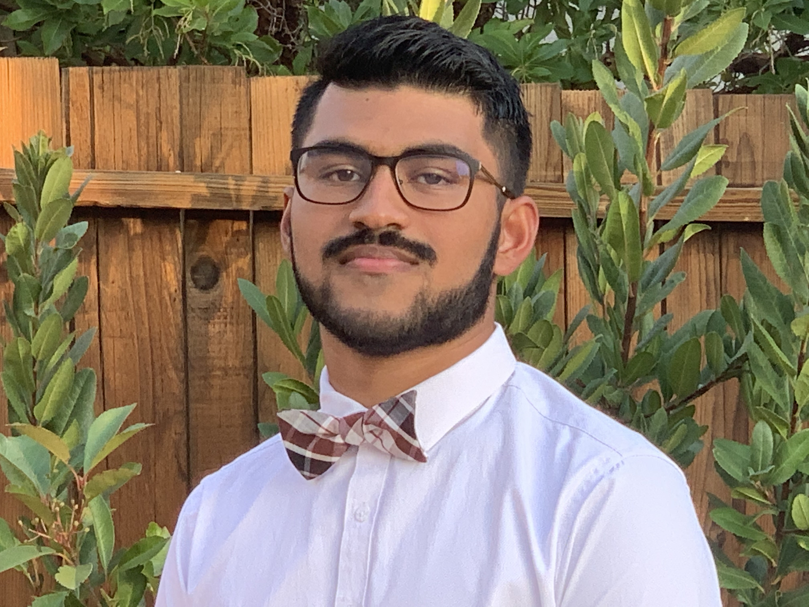
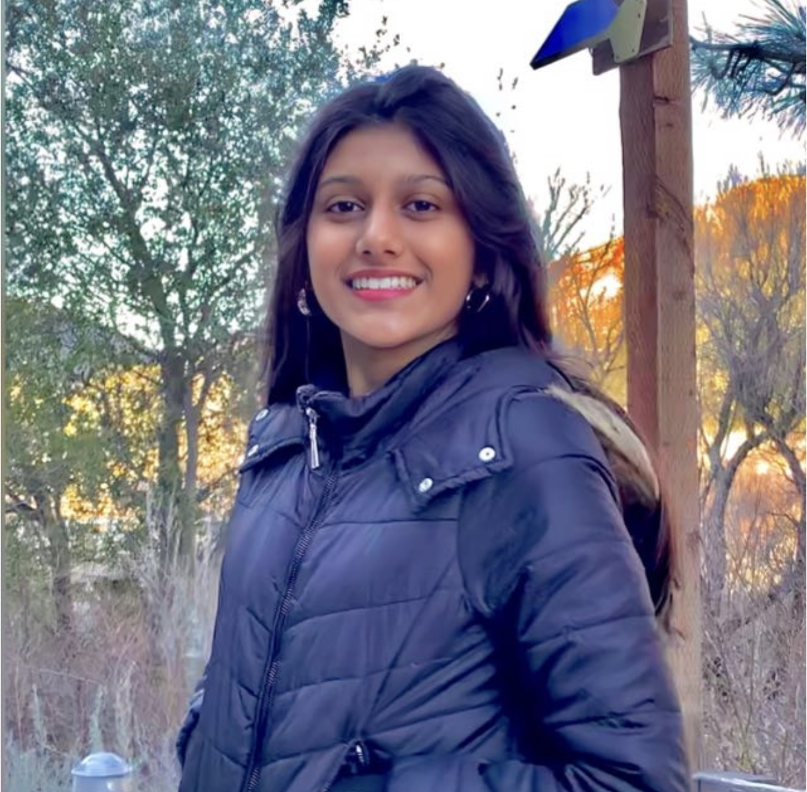

# UCSD Data Science Project 

5 UCSD undergraduate students who are passionate about data science and biology. Creating machine learning models from open source databases. 

## Members:

Seshu Mallina: 

Hi! My name is Seshu Mallina and I am currently a sophomore at UCSD pursuing a degree in Biology with specialiation in Bioinformatics with a minor in Computer Science. I joined this team to learn more about data science and its applications on a biological domian. I think data science is important as one can take existing data and use mathematical and computaional techniques to understand and make predictions. One fun fact about me is that I played on the Warriors basketball court. 

Nehal Ambalkar: 

Brandon Hui:

Marcus Cheung: 

Charvi Shukla: 

[Project 1](Project1.md)

[Literature Review](P1LiteratureReview.md)
