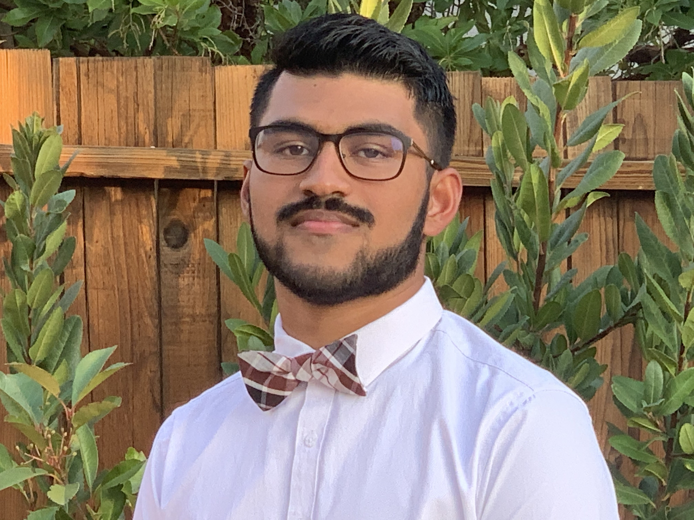
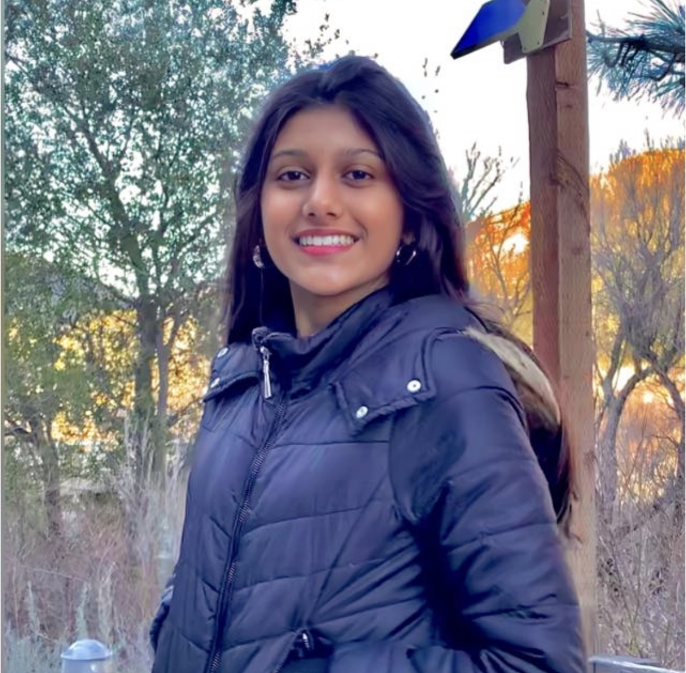
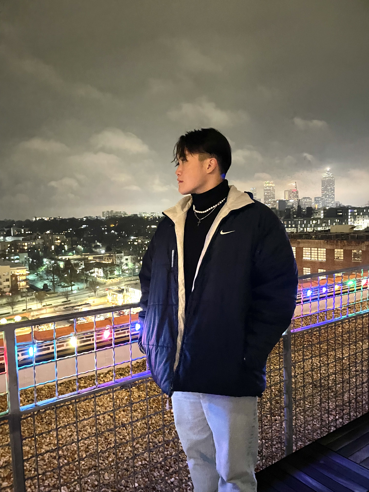
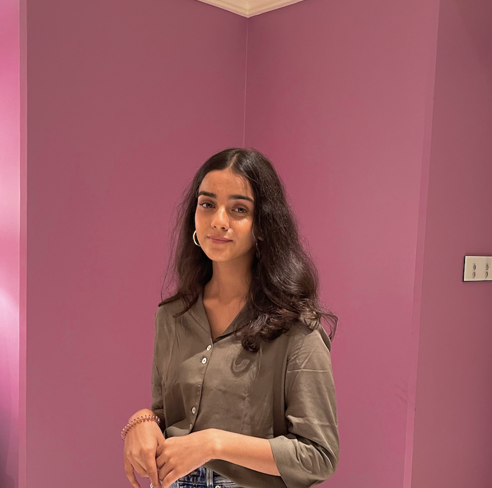

# Members:

**Seshu Mallina:**

Hi! My name is Seshu Mallina and I am currently a 3rd year at UCSD pursuing a degree in Biology with specialiation in Bioinformatics with a minor in Computer Science. I joined this team to learn more about data science and its applications on a biological domian. I think data science is important as one can take existing data and use mathematical and computational techniques to understand and make predictions. One fun fact about me is that I like the Brooklyn Nets. 

**Nehal Ambalkar:**

Hi! My name is Nehal Ambalkar and I am currently a sophomore at UCSD pursuing a degree in Human Biology. I joined this team because I am interested in cancer and want to learn more about it. I think data science is important because it helps us better understand data and trends. One fun fact about me is I am a San Diego native. 

**Brandon Hui:**

Hey guys I am Brandon Hui and am currently a 3rd year majoring in Human Biology. I joined the team to understand and learn how data science can help us gain more insight about cancer by transforming raw data into trends. What I like to do in my free time is to hangout with friends and explore new places. 

**Marcus Cheung:** 

Marcus Cheng, Class of 2024 General Bio Major. I believe that data science is important because it is a key and often understated aspect of the scientific research and review process. I joined because biology is a subject that I'm very interested and curious to learn about how data science can intersect with biology.
One fun fact is that I'm mildly allergic to peaches.

**Charvi Shukla:**

Hello! I am Charvi Shukla, and I am majoring in Math-Computer Science at UC San Diego. I joined this team to gain experience in applying skills from Math and CS into the data science domain. Data Science is not only important in revealing hidden patterns from large data, but it is also a very important application of Computer Science. In my free time, I enjoy drawing portraits of my friends! 