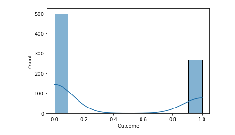

# Project 1: Diabetes Prediction 

In this project our goal was to answer this question: **"Can you build a machine learning model to accurately predict whether or not the patients in the dataset have diabetes or not?"**

# Dataset:

[Link to dataset](https://www.kaggle.com/datasets/uciml/pima-indians-diabetes-database?resource=download)

# Background Information 

# Variables Definition 
1. Pregnancies: Number of times patient was pregnant
2. Glucose: Concentration of glucose after 2 hours [Used an oral glucose tolerance test]
3. Blood Pressure: Diastolic Blood Pressure **(mmHg)**
4. Skin Thickness: Skinfold thickness in triceps **(mm)**
5. Insulin: 2-hour serum insulin **(mmU/mL)**
6. BMI: Body Mass Index calculated using the formula **(weight(kg)/ (height(m)^2))**
7. Diabetes Pedigree Function: Function that scores the likelihood of diabetes based on family history
8. Age: How old they are **Years** 
9. Outcome: Boolean value **0 or 1**

# Data and Visuals
## Single Variable Analysis
**There are a total of 768 observations**
### **Pregnancies**:

| Statistic | Value |
| --- | ----------- |
| Mean | 3.845|
| Standard Deviation | 3.369 |
| Minimum Value | 0.000 |
| Maximum Value | 17.000|
| 1st Quartile | 1.000 |
| 2nd Quartile | 3.000|
| 3rd Quartile | 6.000|

### **Glucose**:

| Statistic | Value |
| --- | ----------- |
| Mean | 120.890|
| Standard Deviation | 31.970 |
| Minimum Value | 0.000 |
| Maximum Value | 199.000|
| 1st Quartile | 99.000 |
| 2nd Quartile | 117.000|
| 3rd Quartile | 140.250|

### **Blood Pressure**:

| Statistic | Value |
| --- | ----------- |
| Mean | 69.105|
| Standard Deviation | 19.350 |
| Minimum Value | 0.000 |
| Maximum Value | 122.000|
| 1st Quartile | 62.000 |
| 2nd Quartile | 72.000|
| 3rd Quartile | 80.000|

### **Skin Thickness**:

| Statistic | Value |
| --- | ----------- |
| Mean | 20.536|
| Standard Deviation | 15.950 |
| Minimum Value | 0.000 |
| Maximum Value | 99.000|
| 1st Quartile | 0.000 |
| 2nd Quartile | 23.000|
| 3rd Quartile | 32.000|

### **Insulin**:

| Statistic | Value |
| --- | ----------- |
| Mean | 79.790|
| Standard Deviation | 115.240|
| Minimum Value | 0.000 |
| Maximum Value | 846.000|
| 1st Quartile | 0.000 |
| 2nd Quartile | 30.500|
| 3rd Quartile | 127.250|

### **BMI**:

| Statistic | Value |
| --- | ----------- |
| Mean | 31.990|
| Standard Deviation | 7.884|
| Minimum Value | 0.000 |
| Maximum Value | 67.100|
| 1st Quartile | 27.300|
| 2nd Quartile | 32.000|
| 3rd Quartile | 36.000|

### **Diabetes Pedigree Function**:

| Statistic | Value |
| --- | ----------- |
| Mean | 0.471|
| Standard Deviation | 0.331|
| Minimum Value | 0.078 |
| Maximum Value | 2.420|
| 1st Quartile | 0.244|
| 2nd Quartile | 0.373|
| 3rd Quartile | 0.626|

### **Age**:

| Statistic | Value |
| --- | ----------- |
| Mean | 33.240|
| Standard Deviation | 11.760|
| Minimum Value | 21.000 |
| Maximum Value | 81.000 |
| 1st Quartile | 24.000|
| 2nd Quartile | 29.000|
| 3rd Quartile | 41.000|

### **Outcome**:

| Statistic | Value |
| --- | ----------- |
| Mean | 0.348|
| Standard Deviation | 0.476|
| Minimum Value | 0.000 |
| Maximum Value | 1.000|
| 1st Quartile | 0.000|
| 2nd Quartile | 0.000|
| 3rd Quartile | 1.000|

## Bivariate Analysis:

# Data Visualization

# Results 

# Conclusion 

# Authors:
Team Advisor: Kyle Shannon

Team Leader and Lead Programmer: Seshu Mallina 

Reserach Leader: Brandon Hui

Research Assistant and Editor: Marcus Cheung

Programming Assistants: Charvi Shukla and Garrett Lam 

# Acknowledgemnets
We would like to acknowledge our project advisor Professor Kyle Shannon of UCSD Cognitive Science deparment for his feedback and support throughout the course of the project. 
